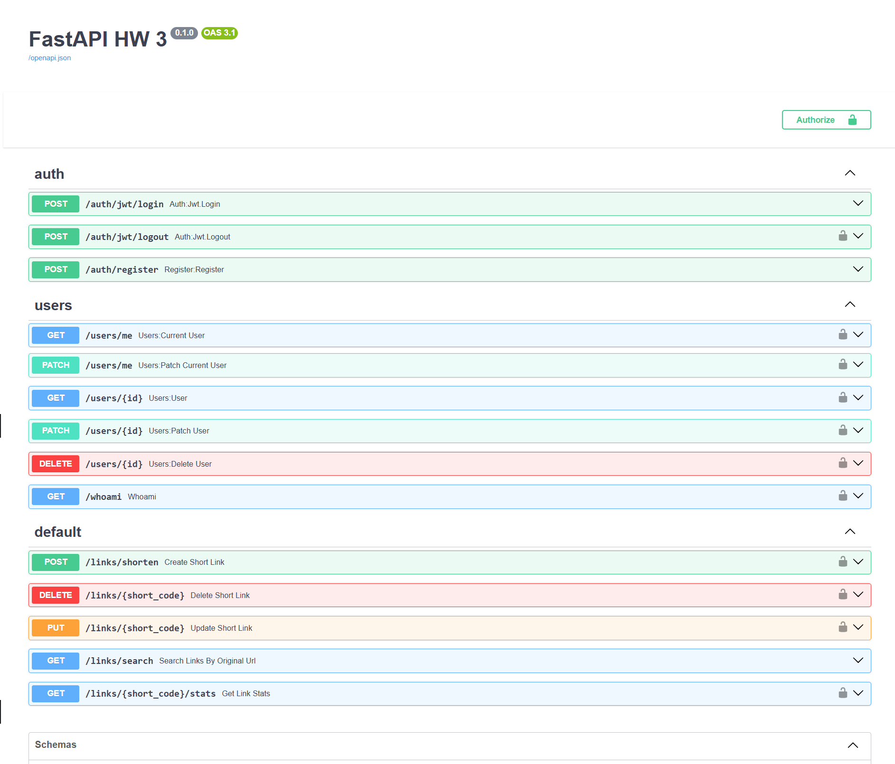

# ✂️ Link Shortener API

API-сервис для сокращения URL с возможностью кастомных alias, статистики, авторизации и управления ссылками.



## 🚀 Возможности

### Обязательные:
- `POST /links/shorten` — создание короткой ссылки (поддержка alias, времени жизни, авторизации)
- `GET /{short_code}` — редирект по короткой ссылке
- `DELETE /links/{short_code}` — удаление ссылки (только авторизованный пользователь)
- `PUT /links/{short_code}` — обновление ссылки (только авторизованный пользователь)
- `GET /links/{short_code}/stats` — статистика по ссылке

### Дополнительные:
- `GET /links/search?original_url={url}` — поиск по оригинальному URL
- Поддержка анонимного создания ссылок

## 🧠 Стек технологий
- **FastAPI** — веб-фреймворк
- **PostgreSQL** — база данных
- **SQLAlchemy** — ORM
- **FastAPI Users** — регистрация и авторизация пользователей

## 📝 Модели
```python
class Link(Base):
    id: int
    original_url: str
    short_code: str
    custom_alias: Optional[str]
    created_at: datetime
    expires_at: Optional[datetime]
    user_id: Optional[int]
```

## 🔐 Авторизация
- Регистрация: `POST /auth/register`
- Вход: `POST /auth/jwt/login`
- Профиль: `GET /users/me`

Авторизация по JWT-токену:
```http
Authorization: Bearer <access_token>
```

## 📦 Установка
```bash
git clone https://github.com/yourname/link-shortener-api.git
cd link-shortener-api
python -m venv .venv
source .venv/bin/activate  # Windows: .venv\Scripts\activate
pip install -r requirements.txt
alembic upgrade head
uvicorn src.main:app --reload
```

## 🐳 Docker (опционально)
```bash
docker-compose up --build
```

## 🧪 Примеры запросов

### Создание:
```json
POST /links/shorten
{
  "original_url": "https://example.com",
  "custom_alias": "myalias",
  "expires_at": "2025-06-01T12:00:00"
}
```

### Обновление:
```json
PUT /links/myalias
{
  "original_url": "https://newexample.com"
}
```

### Удаление:
```http
DELETE /links/myalias
```

### Статистика:
```http
GET /links/myalias/stats
```

## 📄 Описание базы данных
- `user` — пользователи
- `link` — ссылки с привязкой к пользователю (или null)

## 👨‍💻 Авторы
  Сидоров Константин Алексеевич
- [@SiDoor](https://github.com/sidorov-ka)

## ✅ Примечания
- Анонимные пользователи могут только создавать и переходить по ссылкам
- Зарегистрированные — могут управлять только своими ссылками

# python_hw3_fastapi